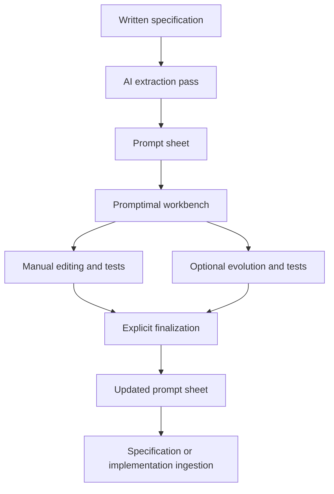
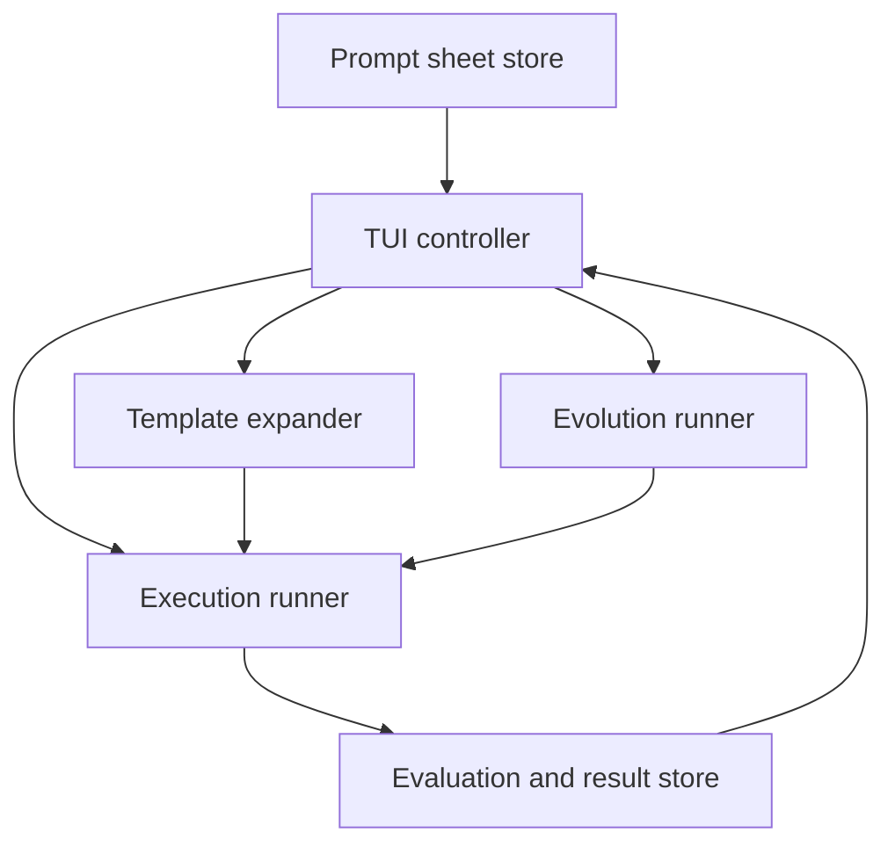
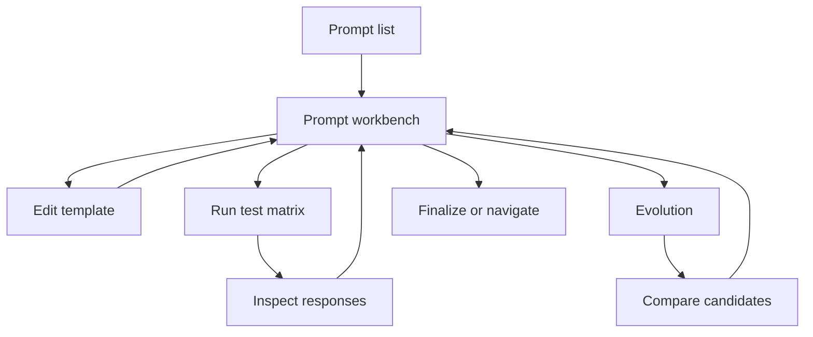

# Promptimal Prompt Refinement and Cross-Model Behavioral Testing Workbench

Status: Build specification  
Prompt-sheet format: `promptimal.prompt-sheet` version `1.0.0`  
Repository basis: [`RchGrav/promptimal` at commit `e03cbc1db19c7ec6c310605a9819e35c2baed023`](https://github.com/RchGrav/promptimal/tree/e03cbc1db19c7ec6c310605a9819e35c2baed023), inspected 2026-09-02

## 1. Purpose

This adaptation turns Promptimal into a human-controlled workbench for refining the reusable linguistic implementation of one defined LLM inference operation at a time.

The workbench begins with a machine-readable prompt sheet extracted from a written system specification. The extraction pass is allowed to produce imperfect starting prompts. Promptimal then lets a human edit a prompt template, expand it with representative runtime values, execute it repeatedly against configured models, inspect the actual responses, optionally breed alternative prompt templates, adopt or reject candidates, and explicitly finalize a revision.

The primary object being refined is:

> A reusable linguistic implementation of one defined inference operation.

The intent, runtime variables, test cases, intended responses, output contract, and explicit behavioral requirements define the operation being tested. Manual refinement and evolution change the prompt template. They do not redefine the operation.

The complete lifecycle is:



## 2. Boundaries

### 2.1 In scope

- Loading and updating a JSON prompt sheet containing multiple inference operations.
- Sequential, captive TUI review of those operations.
- Named f-string-style prompt variables and case-by-case expansion.
- Manual editing with revision history.
- Execution against an OpenRouter model matrix.
- Repeated runs for each model and test case.
- Structural, exact, requirement-based, semantic, and human-reviewed response evaluation as appropriate to the operation.
- Separate reporting of task success, output-contract compliance, repeatability, cross-model agreement, evaluation coverage, and failure distribution.
- Preservation of actual outputs and the model, request, parameters, provider, usage, cost, and timing observed for each execution.
- Optional prompt evolution using observed execution results as fitness.
- Candidate diffs, response inspection, manual adoption, continued breeding, manual modification, restoration, and rejection.
- Explicit finalization and machine-readable re-ingestion.
- Derivation of a task/model capability matrix from dated observations associated with particular prompt revisions.

### 2.2 Out of scope

- A generalized LLM evaluation platform.
- A generic prompt-management or prompt-sharing product.
- Autonomous rewriting or finalization of prompts.
- Scoring prompt prose because another LLM considers it clear, elegant, short, or well written.
- Changing inference intent, test values, intended responses, output contracts, or behavioral requirements during evolution.
- Assuming that agreement means correctness.
- Assuming one model is best for all inference operations.
- Inspecting internal neural activations of hosted models.
- Automatically converting the declared output contract into provider-side structured-output enforcement. If the production invocation uses `response_format`, it is included explicitly in the execution profile so the test reproduces that invocation.
- Requiring evolution. A prompt can be refined and finalized entirely by manual editing and testing.

This specification does not require removal or migration of Promptimal's existing one-prompt CLI mode. The prompt-sheet workbench is the new primary workflow; unrelated compatibility behavior can remain unless changed separately.

## 3. Fixed distinctions

The workbench must keep the following fields separate because they answer different questions.

| Field | Question answered | Changed by evolution |
| --- | --- | --- |
| `intent` | What inference operation is the system asking the model to perform? | No |
| `prompt_template` | How is that operation currently expressed to a model? | Yes |
| `variables` | Which runtime values are substituted into the reusable expression? | No |
| `test_cases` | Which representative runtime values exercise the operation? | No |
| `intended_response` | What semantic result is intended for a test case? | No |
| `output_contract` | What response type and presentation format are required? | No |
| `behavioral_requirements` | Which explicit semantic or exclusion requirements came from the specification? | No |
| `evaluation_plan` | How are actual responses compared without changing the inference? | No |
| `result_sets` | What happened when one revision was executed? | Observed, never authored by evolution |
| `revisions` | Which prompt expressions have been retained? | A candidate enters this list only after the user adopts it |

The intended response is not the output contract. A response can satisfy `string[]` and still be semantically wrong. It can also be semantically right and fail the required presentation format. The TUI and stored results report these outcomes separately.

## 4. Existing Promptimal baseline

The inspected repository is a small Python package using `urwid`, `asyncio`, the OpenAI Python client, and a genetic loop.

Current behavior at the inspected commit:

- [`promptimal/app.py`](https://github.com/RchGrav/promptimal/blob/e03cbc1db19c7ec6c310605a9819e35c2baed023/promptimal/app.py) provides an `urwid` application, an asyncio event loop, a prompt diff, progress rows, token/cost display, clipboard copying, and exit handling.
- [`promptimal/optimizer/main.py`](https://github.com/RchGrav/promptimal/blob/e03cbc1db19c7ec6c310605a9819e35c2baed023/promptimal/optimizer/main.py) provides population initialization, asynchronous evaluation, elitism, tournament parent selection, crossover, threshold termination, and progress events.
- [`promptimal/optimizer/utils.py`](https://github.com/RchGrav/promptimal/blob/e03cbc1db19c7ec6c310605a9819e35c2baed023/promptimal/optimizer/utils.py) generates candidates and currently calculates fitness by asking `gpt-4o` to score the candidate prompt text five times.
- [`promptimal/optimizer/prompts.py`](https://github.com/RchGrav/promptimal/blob/e03cbc1db19c7ec6c310605a9819e35c2baed023/promptimal/optimizer/prompts.py) contains the mutation, crossover, and prompt-prose evaluation instructions.
- [`promptimal/dtos/PromptCandidate.py`](https://github.com/RchGrav/promptimal/blob/e03cbc1db19c7ec6c310605a9819e35c2baed023/promptimal/dtos/PromptCandidate.py) stores only the prompt, one scalar fitness value, and one reflection.
- [`promptimal/promptimal.py`](https://github.com/RchGrav/promptimal/blob/e03cbc1db19c7ec6c310605a9819e35c2baed023/promptimal/promptimal.py) parses one initial prompt, one free-form improvement request, loop hyperparameters, and an optional subprocess evaluator.

The evolutionary skeleton is reusable. The current evaluation meaning, single-prompt state, scalar candidate model, fixed `gpt-4o` calls, and monitor-only TUI are not sufficient for this workbench.

The user's OpenRouter changes may already replace part of the client initialization described above if they exist outside the inspected commit. This specification defines the required behavior of the adapter and does not require that work to be repeated.

## 5. System shape

The first implementation remains one Python application and one JSON prompt sheet. It does not need a service, database, or web application.



The components are:

1. **Prompt-sheet store**: strict JSON loading, schema validation, reference checks, atomic writes, and finalized export.
2. **TUI controller**: prompt navigation, editing, test configuration, result inspection, evolution, candidate adoption, history, and finalization.
3. **Template expander**: safe named-placeholder parsing and expansion for the selected test case.
4. **Execution runner**: model-by-case-by-trial scheduling, OpenRouter calls, response capture, and partial-result persistence.
5. **Evaluation engine**: output parsing, JSON Schema validation, explicit requirement checks, task evaluation, normalization, clustering, metrics, and failure tags.
6. **Evolution runner**: candidate generation and crossover, behavioral testing, lexicographic ranking, lineage, and generation control.
7. **Export API**: direct loading or projection of finalized definitions for a specification or implementation pass.

## 6. Prompt-sheet input/output contract

The prompt sheet is one UTF-8 JSON file. It is both the workbench input and its durable output. Promptimal updates the same structure after edits, tests, candidate runs, adoption, and finalization.

The normative schema is supplied as `prompt-sheet.schema.json`. A schema-valid example is supplied as `prompt-sheet.example.json`.

### 6.1 Top-level shape

```json
{
  "format": "promptimal.prompt-sheet",
  "format_version": "1.0.0",
  "sheet_id": "vivi.prompt-operations",
  "title": "Vivi inference-operation prompt sheet",
  "description": "...",
  "source": {
    "type": "written_specification",
    "reference": "Vivi Core Specification",
    "revision": "optional source revision",
    "extracted_at": "2026-09-02T00:00:00Z"
  },
  "default_execution_profile_id": "frontier-core",
  "execution_profiles": [],
  "prompts": [],
  "result_sets": [],
  "evolution_runs": [],
  "updated_at": "2026-09-02T00:00:00Z"
}
```

| Top-level field | Meaning |
| --- | --- |
| `format` | Stable file-family identifier. |
| `format_version` | Data-contract version, not a prompt revision. |
| `sheet_id` | Stable identity for this prompt collection. |
| `source` | Written specification from which the extraction pass produced the initial records. The source revision is informational, not a runtime hash gate. |
| `execution_profiles` | Named model matrices and repeated-run settings. No credentials are stored. |
| `prompts` | Inference-operation definitions and prompt revision histories. |
| `result_sets` | Actual executions and derived observations tied to prompt revisions. |
| `evolution_runs` | Candidate templates, lineage, result references, and adoption outcomes. |

### 6.2 Prompt record

Every prompt record contains:

```json
{
  "id": "namespace.aliases",
  "intent": "...",
  "source_references": ["..."],
  "state": "unreviewed",
  "current_revision_id": "namespace.aliases.r0001",
  "finalization": null,
  "finalization_history": [],
  "variables": [],
  "test_cases": [],
  "output_contract": {},
  "behavioral_requirements": [],
  "evaluation_plan": {},
  "revisions": []
}
```

The `id` is the stable key used by the written specification, generated implementation, results, and capability matrix. Changing prompt wording never changes the prompt ID.

### 6.3 Intent

`intent` states the inference operation independently of the current prompt wording. It describes the question the system needs the model to answer, not why a candidate prompt is considered better.

The extraction pass copies or minimally organizes this meaning from the source specification. It does not rewrite the operation into an easier task for the evaluator.

### 6.4 Variables

Each variable declares its name, meaning, whether the runtime value is required, and the JSON Schema for that value.

```json
{
  "name": "identifier",
  "description": "Canonical identifier whose aliases are being inferred.",
  "required": true,
  "value_schema": {
    "type": "string"
  }
}
```

The variable list is the declared interface of the prompt template. Test-case values exercise that interface.

### 6.5 Test cases and intended responses

Each test case has a stable ID, runtime values, and its own intended response. Case-specific intended responses are necessary because one reusable template is tested against several concrete inputs.

`intended_response.kind` supports three forms:

| Kind | Representation | Evaluation meaning |
| --- | --- | --- |
| `exact` | Any JSON value in `value` | The declared comparator may determine pass or fail directly. |
| `representative` | Any JSON value in `value` plus a description | The value shows an intended answer but is not silently treated as exhaustive. Task evaluation uses the declared requirements, a semantic evaluator, or human review. |
| `criteria` | A description plus an array of criteria | Suitable for constrained open-ended responses. Each criterion is evaluated separately when possible. |

`provenance.kind` records whether an intended response came from specification text, a specification example, the extraction AI's inference, or human review. This keeps inferred starting data visible instead of presenting it as source authority.

Structured intended responses use normal JSON objects or arrays in `value`. Their structure is still declared separately in `output_contract`.

### 6.6 Output contract

The output contract contains:

- A plain-language description.
- A media type such as `application/json` or `text/plain`.
- A display shape such as `string[]`, `object`, `boolean`, `enum`, or `free text`.
- A JSON Schema applied to the parsed response value.
- Explicit presentation constraints from the originating specification.

Example:

```json
{
  "description": "Return a JSON array containing strings and no surrounding prose.",
  "media_type": "application/json",
  "display_shape": "string[]",
  "schema": {
    "type": "array",
    "items": {
      "type": "string"
    }
  },
  "presentation_constraints": [
    "Return the JSON array only.",
    "Do not wrap the response in a Markdown code fence."
  ]
}
```

The parser tests the raw response before normalization. A JSON repair library must not silently convert malformed output into a pass. If a repaired view is useful for inspection, it is shown separately and the original contract failure remains recorded.

### 6.7 Behavioral requirements

Behavioral requirements preserve explicit semantic and exclusion requirements from the specification. Each requirement has an ID, text, provenance, and an optional deterministic check.

```json
{
  "id": "exclude-canonical-identifier",
  "text": "Exclude the canonical identifier value supplied by {identifier}.",
  "provenance": {
    "kind": "specification",
    "reference": "Namespace alias operation",
    "note": null
  },
  "check": {
    "type": "json_array_excludes_expanded_exact_string",
    "parameters": {
      "template": "{identifier}"
    }
  }
}
```

The initial built-in deterministic checks are limited to behavior needed by extracted records:

- Exact equality for scalar JSON values.
- Ordered sequence equality.
- Unordered sequence equality with declared duplicate and case behavior.
- JSON object deep equality.
- JSON Schema validation.
- Inclusion or exclusion of an exact expanded scalar value at a declared JSON location.
- Regex matching only when the specification itself defines a textual pattern.

Other requirements remain semantic checks. The extraction pass does not invent a deterministic rule merely because one would make scoring easier.

### 6.8 Evaluation plan

The evaluation plan selects:

- A normalizer used for response clustering and repeatability.
- A task evaluator used to compare a response with the intended response.
- A similarity method used for within-model and cross-model agreement.

The plan is explicit because the same output shape may need different semantics. An array can be ordered, unordered, or a multiset. A JSON object can require complete equality or only criteria stated by the specification.

### 6.9 Complete example record

The companion `prompt-sheet.example.json` is part of this specification. It contains a complete `namespace.aliases` prompt record with:

- The intent.
- Five named runtime variables.
- Three representative input cases.
- Concrete exact intended-response examples with visible provenance.
- A `string[]` output contract.
- Explicit behavioral requirements.
- A deterministic comparison plan.
- An initial extracted revision and state.
- An illustrative repeated-run OpenRouter profile.

The example's expected alias arrays demonstrate the exact-response representation. The file marks them as illustrative human-reviewed data; they are not presented as text extracted from the originating Vivi specification.

### 6.10 Validation behavior

The loader performs two levels of validation:

1. JSON Schema validation using `prompt-sheet.schema.json`.
2. Reference validation for unique IDs, current and finalized revision references, profile references, result references, candidate references, placeholder declarations, and test-case values.

The loader reports record-local problems with the prompt ID and JSON path. A bad prompt record does not make unrelated valid records unusable. A record with a missing template variable is visible in the list with an expansion diagnostic and cannot produce a model execution for the affected case; the tool records that outcome rather than substituting a guessed value.

The loader does not silently repair JSON, rename IDs, fill missing semantic fields, rewrite templates, or discard unknown result data.

Writes use a temporary file and atomic replacement. A write updates `updated_at` only after the complete updated sheet has been serialized successfully.

## 7. Prompt expansion

Prompt templates use Python f-string-style named fields:

```text
{name}
{description}
{namespace}
{identifier}
{prefix}
```

The implementation uses `string.Formatter().parse()` or equivalent field parsing. It does not call `eval` and does not execute Python expressions.

Expansion rules:

1. Every simple named field in the current template is shown in the variable panel.
2. Every selected test-case value is validated against the corresponding variable's `value_schema`.
3. The selected case is expanded into a read-only preview beside or below the editable template.
4. Literal braces use `{{` and `}}`.
5. Missing fields, undeclared fields, malformed braces, or invalid case values produce visible expansion diagnostics for that case.
6. Expansion converts values to their normal string form. No quoting, JSON encoding, truncation, or escaping is added unless it is present in the prompt template.
7. The exact expanded string sent to the model is retained in each execution record.

The TUI always distinguishes **Template** from **Expanded Prompt** so that the user edits the reusable operation rather than one concrete case.

## 8. Prompt state and revision model

### 8.1 States

| State | Meaning |
| --- | --- |
| `unreviewed` | Initial extracted record has not yet been adopted into the refinement workflow. |
| `in_refinement` | The current revision was manually edited or adopted and has not completed a test against the selected working profile since that change. |
| `tested` | At least one result set has completed for the current revision. This state does not mean the result passed. |
| `finalized` | The user explicitly selected a revision as the approved downstream revision. |

Scores never set `finalized` automatically.

### 8.2 Revisions

Every saved prompt expression is a revision containing:

- Stable revision ID.
- Monotonic sequence number within the prompt record.
- Parent revision ID.
- Complete prompt template.
- Origin: extraction, manual edit, candidate adoption, restoration, or import.
- Candidate ID when adopted from evolution.
- Creation time and optional note.

Revisions are immutable after creation. Editing creates a child revision. Selecting a previous revision changes `current_revision_id`; a later edit branches from that revision. This preserves the version the user returned from and the version they abandoned.

### 8.3 Transitions

| User event | Revision effect | State effect |
| --- | --- | --- |
| Open prompt | None | None |
| Save manual edit | Create child revision and make it current | `in_refinement` |
| Test an unsaved edited buffer | Create a manual child revision, make it current, then test it | `in_refinement`, then `tested` when the result set completes |
| Adopt candidate | Create child revision containing the candidate template | `in_refinement` |
| Select prior revision | Change current pointer | State reflects whether that selected revision is the finalized revision or has completed results |
| Finalize | Record current revision and time in `finalization` and append the event to `finalization_history` | `finalized` |
| Edit after finalization | Keep the previous `finalization`; create a new current child revision | `in_refinement` |
| Finalize the new revision | Replace `finalization` with the newly approved revision | `finalized` |

Keeping the old finalization while a new revision is being explored allows downstream tooling to continue using the last explicitly approved revision.

## 9. Captive TUI workflow

The primary interaction is menu driven. Every action is visible in an action bar or selectable menu; keyboard shortcuts may exist but are always shown and are not required knowledge.

### 9.1 Prompt list screen

The opening screen contains:

| Column | Content |
| --- | --- |
| Prompt ID | Stable inference-operation ID. |
| Intent | First line or shortened visible description. |
| State | `unreviewed`, `in refinement`, `tested`, or `finalized`. |
| Current revision | Current revision ID. |
| Last test | Time and execution profile. |
| Portable pass | Worst model/case full-pass rate when task evaluation coverage exists. |
| Weakest cell | Model and case currently limiting the result. |

The bottom menu contains:

```text
Open Prompt | Test Selected | Filter by State | Configure Models | Save | Exit
```

Filtering never changes the stored order. Sequential **Next Prompt** and **Previous Prompt** use prompt-sheet order so the user can work through the collection without remembering IDs or commands.

### 9.2 Prompt workbench screen

The working view shows:

- Prompt ID and state.
- Intent.
- Current prompt template.
- Expanded prompt for the selected case.
- Declared variables and selected case values.
- Selected test case and intended response.
- Output contract.
- Behavioral requirements.
- Current revision and parent.
- Latest test summary.
- Model-by-model and case-by-case results.
- Weakest cells, response clusters, and failure distribution.
- Revision and evolution history.

A practical terminal layout is:

```text
Prompt: namespace.aliases          State: tested          Revision: r0017

Intent
Infer only the most common aliases ...

Template                         Expanded: C++
------------------------------   ----------------------------------------
... "{name}" ...                 ... "C++" ...
... "{identifier}" ...           ... "cplusplus" ...

Case: C++     Intended: ["c++", "cpp"]     Output: string[]

Model / Case            Task     Contract   Repeatability   Failures
Frontier A / C++         100%      100%         100%         0
Frontier B / C++          80%      100%          80%         1 rare alias

Edit Prompt | Test Current Prompt | Inspect Responses | Try Evolution
Compare Candidates | Select Candidate | Finalize | Previous | Next
```

### 9.3 Menu flow



### 9.4 Immediate actions

The prompt workbench provides the equivalent of:

- **Edit Prompt**
- **Test Current Prompt**
- **Inspect Responses**
- **Try Breeding / Evolution**
- **Compare Candidates**
- **Select Candidate**
- **Return to Manual Editing**
- **Finalize**
- **Next Prompt**
- **Previous Prompt**

Additional contextual actions are **Select Test Case**, **Select Execution Profile**, **View Intent**, **View Output Contract**, **View Requirements**, **View Revision History**, **Use Previous Revision**, and **Reject Generation**.

## 10. Manual editing behavior

The editor opens the complete current template in a multiline edit widget.

- Named fields are visually distinguished.
- The selected case's expanded preview updates as the buffer changes.
- The variable panel shows each declaration and current value.
- The user can change cases without leaving the editor.
- The user can save the buffer as a revision, test it directly, discard it, or return to the prior revision.
- **Test Current Prompt** automatically creates a revision if the tested buffer differs from the current saved revision. This guarantees that every result set names the exact revision it tested without forcing a separate save step.
- Saving or testing does not claim the edit improved the prompt.
- The editor does not rewrite wording, normalize whitespace, add requirements, or remove repeated text on its own.

Manual and evolutionary work can alternate without mode changes:

```text
manual edit -> test -> manual edit -> evolve current revision
-> inspect candidates -> adopt or reject -> manual edit -> test -> finalize
```

## 11. Model configuration and OpenRouter execution

### 11.1 Execution profiles

An execution profile defines:

- Profile ID and label.
- Number of repeated runs per model/case cell.
- Maximum request concurrency.
- Request timeout.
- Explicit transport retry count.
- One or more target models.

Each target defines:

- Stable local target ID and label.
- Adapter name.
- OpenRouter model slug.
- Enabled state.
- Exact inference parameters.
- Exact OpenRouter provider-routing object, if any.

Credentials are read from `OPENROUTER_API_KEY` or the user's existing credential mechanism and are never written to the prompt sheet.

### 11.2 Adapter

The first adapter is `openrouter-chat-completions`. It can continue using Promptimal's existing `openai` Python dependency with:

```python
AsyncOpenAI(
    base_url="https://openrouter.ai/api/v1",
    api_key=os.environ["OPENROUTER_API_KEY"],
    max_retries=profile.max_transport_retries,
)
```

OpenRouter documents the OpenAI client as a supported drop-in path with that base URL and API key contract. See the [OpenRouter quickstart](https://openrouter.ai/docs/quickstart).

For each execution, the adapter sends:

```json
{
  "model": "<target.model>",
  "messages": [
    {
      "role": "user",
      "content": "<expanded prompt>"
    }
  ],
  "<parameter>": "<exact configured value>",
  "provider": {
    "<routing option>": "<exact configured value>"
  }
}
```

The `provider` member is omitted when `provider_routing` is empty. The request snapshot still records the empty configured object.

OpenRouter normalizes chat-completion responses across providers and returns response IDs, the returned model, finish reasons, native finish reasons, token usage, and optional cost data. Those fields are retained when available. See the [OpenRouter API response contract](https://openrouter.ai/docs/api_reference/overview).

### 11.3 No hidden request changes

The adapter sends the configured parameters exactly as stored.

- It does not insert a temperature, seed, system prompt, stop sequence, response format, response-healing plugin, reasoning setting, or provider rule that the profile did not specify.
- It does not infer `response_format` from `output_contract`.
- It does not silently remove unsupported parameters. OpenRouter notes that some unsupported non-standard parameters may be ignored by the routed model or provider, so the request snapshot and returned provider metadata remain visible. See [OpenRouter parameters](https://openrouter.ai/docs/api_reference/parameters).
- It records every transport attempt when retries are configured. A failed transport attempt is not counted as a model response.

If the intended production call uses provider-side structured outputs, the profile explicitly contains the corresponding `response_format`. This matters because structured-output support can vary by model endpoint and provider. See [OpenRouter structured outputs](https://openrouter.ai/docs/guides/features/structured-outputs).

### 11.4 Model metadata

When available, the tool can snapshot the model's canonical slug, supported parameters, context length, and current pricing from OpenRouter's Models API. The snapshot is stored with the result set, not the prompt's semantic definition. OpenRouter exposes model IDs, canonical slugs, supported parameters, and pricing through its [Models API](https://openrouter.ai/docs/guides/overview/models).

## 12. Repeated-run testing

For a prompt revision, profile, selected cases, and selected targets, the runner constructs the Cartesian product:

```text
targets x test cases x repeated runs
```

The planned request count is:

\[
N = |M| \times |C| \times R
\]

where \(M\) is the enabled model targets, \(C\) is the selected test cases, and \(R\) is `runs_per_case`.

The test screen shows this count and begins when the user selects **Start Test**. The profile's existing values are preselected; the user is not forced through a questionnaire for every run.

Execution behavior:

1. Resolve the prompt and revision.
2. Expand the template independently for every selected case.
3. Create one execution record for every planned cell and trial.
4. Schedule requests under the configured concurrency limit.
5. Persist completed execution records throughout the run so cancellation or process failure does not erase observed responses.
6. Parse and evaluate each response.
7. Recalculate cell, model, case, and overall summaries as results arrive.
8. Mark the result set `completed`, `cancelled`, or `failed` without discarding completed executions.

API errors, timeouts, expansion errors, and cancellations are reported as execution coverage failures. They are not silently converted into task failures and are not included as model responses when calculating behavioral agreement.

## 13. Response and result storage

Every execution record retains:

- Prompt ID and revision through its parent result set.
- Test-case ID, model-target ID, and trial number.
- Exact expanded prompt.
- Exact message array, model slug, parameters, and provider routing sent.
- Raw response text.
- Parsed response value when parsing succeeds.
- Response ID, returned model, provider, normalized and native finish reason.
- Token usage, returned cost, and latency when available.
- Transport error details when no model response was obtained.
- Output-contract checks.
- Behavioral-requirement checks.
- Task evaluation and its provenance.
- Semantic-evaluator and human-review observations, including the evaluator request and response when applicable.
- Normalized value used for comparison.
- Failure tags.

Raw outputs are retained for successful, differing, and failed responses. Clusters are indexes over retained outputs, not replacements for them.

Result sets are observations associated with a prompt revision and an execution-profile snapshot. Re-running a revision creates another result set. It does not overwrite previous observations.

Each result set also stores an operation snapshot containing the intent, variable declarations, selected case definitions and intended responses, output contract, behavioral requirements, and evaluation plan used for that run. This keeps historical observations interpretable if a later specification pass deliberately updates the operation definition.

## 14. Behavioral evaluation

Evaluation occurs in four visible layers.

### 14.1 Output-contract compliance

The raw output is parsed according to `media_type`, then validated against `output_contract.schema` and presentation constraints.

Examples:

- `string[]`: parse JSON, require an array, require every item to be a string, and reject surrounding prose if the contract says array only.
- `object`: parse JSON and validate its declared object schema.
- `boolean`: require the declared boolean representation.
- `enum`: compare with the declared values.
- Free text: validate only constraints explicitly stated in the contract.

### 14.2 Behavioral requirements

Each deterministic requirement check reports `pass`, `fail`, `unknown`, or `not_run`. Semantic requirements remain visible individually rather than being hidden inside one score.

### 14.3 Task and intended-response success

The task evaluator is selected by the prompt record:

- Exact scalar equality.
- Ordered sequence equality.
- Unordered sequence or multiset equality with explicit case and duplicate behavior.
- JSON deep equality.
- Declared field or criterion checks.
- Human response-cluster labels.
- Semantic-criteria evaluation for open-ended results.

For structured results, deterministic structure-aware comparison is used. Embeddings do not replace JSON parsing, schema validation, set comparison, sequence comparison, or object comparison.

For genuinely semantic or open-ended results:

1. The evaluator receives the intent, selected case values, intended response, output contract, behavioral requirements, and actual response.
2. It returns a result for each stated criterion or requirement, a task result, and a short explanation tied to the response.
3. The evaluator's model, prompt, parameters, and repeated outputs are stored as observations when an LLM evaluator is used.
4. Human review can assign or override pass/fail labels on response clusters. The provenance of the label is retained.
5. The evaluator judges the model response against the defined operation. It never judges whether the candidate prompt prose looks well written.

Embedding similarity can be used to cluster open-ended responses when a visible threshold and embedding model are configured. It does not establish task correctness by itself unless the prompt record explicitly declares it as the task evaluator.

### 14.4 Evaluation coverage

`evaluation_coverage` is the proportion of model responses for which task success is known. Unknown semantic results remain unknown. They are not counted as failures or silently treated as passes.

Candidates with task evaluation coverage below `1.0` can still be executed, inspected, compared for contract behavior, manually adopted, and finalized. Automatic breeder parent selection pauses for that generation until the user labels the unknown response clusters or manually selects the next parent. This prevents agreement or formatting from silently standing in for task success.

## 15. Metrics

Metrics are shown separately. The UI does not collapse them into one opaque prompt score.

Let an execution be **fully passing** when:

- A model response was obtained.
- The output contract passed.
- Every deterministically evaluable explicit requirement passed.
- The task evaluator returned `pass`.

For each model/case cell:

```text
task success rate       = task passes / task-evaluated responses
contract compliance     = contract passes / model responses
full pass rate          = fully passing responses / task-evaluated responses
evaluation coverage     = task-evaluated responses / model responses
```

### 15.1 Within-model repeatability

For a model/case cell, normalize each model response using the declared normalizer. Repeatability is the proportion of response pairs in that cell that compare equal or fall into the same declared semantic cluster:

\[
repeatability = \frac{\text{agreeing within-cell response pairs}}{\text{all within-cell response pairs}}
\]

The UI also shows the modal cluster and its share because it is easier to interpret directly.

### 15.2 Cross-model agreement

For each test case, compare normalized responses only across different model targets:

\[
agreement = \frac{\text{agreeing cross-model response pairs}}{\text{all comparable cross-model response pairs}}
\]

Case results are reported separately and may be summarized by an unweighted mean. Agreement remains distinct from task success, so unanimous wrong answers do not appear as successful behavior.

### 15.3 Weakest cells

The portable-behavior view sorts model/case cells by full pass rate and then evaluation coverage. It always shows the weakest tested intersections, for example:

```text
Model X / postgresql     60% full pass
Model D / cplusplus      80% full pass
```

This is more informative than hiding a weak intersection in a model-wide or prompt-wide average.

### 15.4 Failure distribution

Failure tags come from observed layers:

- Expansion or transport result such as `expansion_error`, `api_error`, or `timeout`.
- Output-contract check IDs.
- Behavioral-requirement IDs.
- Task-evaluator criteria.
- Finish reasons such as length or content filtering.

The tool counts these tags overall and by model/case cell. It does not invent semantic failure categories that are not produced by a declared evaluator or human review.

## 16. Failure inspection

**Inspect Responses** opens a matrix with models as rows and cases as columns. Each cell shows runs, task pass rate, contract rate, repeatability, and failure count.

Selecting a cell shows:

- Normalized response clusters and counts.
- Every raw response in the selected cluster.
- Successful and failed runs.
- Contract and requirement check results.
- Intended response beside the actual response.
- Request parameters, provider, finish reason, latency, usage, and cost.
- A diff between two selected raw or normalized responses.

Filters include:

- Failures only.
- Contract failures.
- Task failures.
- Requirement ID.
- Model.
- Test case.
- Response cluster.
- Transport errors.

The weakest-cell view links directly into the underlying runs.

## 17. Evolution and breeding

### 17.1 Starting point

**Try Evolution** starts from the current manually edited revision by default. The user may instead continue from a selected candidate. The screen uses stored defaults for population size, generation limit, mutator target, execution profile, cases, and repeats; each remains adjustable.

Evolution is optional and can be abandoned without altering the current prompt revision.

### 17.2 Candidate generation

The mutator receives:

- Fixed intent.
- Current parent template or parent templates.
- Declared placeholder names and descriptions.
- Output contract.
- Explicit behavioral requirements.
- Aggregate observed failure information from the parent when available.

The mutator returns only candidate prompt templates. Concrete test-case intended answers are not needed for mutation and are not inserted into the mutation context. Evaluation receives the full cases and intended responses after candidate generation.

The mutator output schema is:

```json
{
  "candidates": [
    {
      "prompt_template": "..."
    }
  ]
}
```

Generated candidates are retained even when they contain malformed braces, omit declared fields, or otherwise cannot expand. Such a candidate is marked `not_executable` with its observed diagnostic. It is not silently fixed or replaced.

### 17.3 Behavioral fitness

Every executable candidate is run against the same selected test cases, intended responses, output contract, behavioral requirements, models, parameters, and repeated-run count.

Candidate selection uses a lexicographic behavioral vector rather than an averaged prose-quality score:

1. Highest worst model/case full-pass rate.
2. Highest overall full-pass rate.
3. Highest worst model/case task-success rate.
4. Highest output-contract compliance.
5. Highest within-model repeatability.
6. Highest cross-model agreement.

The automatic vector applies to candidates whose task evaluation coverage is `1.0`. If any candidate in the generation has unknown task outcomes, the TUI shows the incomplete coverage and pauses automatic parent selection; the user can label the unknown clusters, exclude that candidate from the generation, or manually choose the next parent. The user can always inspect or adopt any candidate regardless of coverage.

This ordering favors the portable candidate whose weakest model/case intersection performs best, even when another candidate has a higher average because it performs very well on most models and poorly on one.

### 17.4 Evolution loop

The retained Promptimal loop becomes:

1. Include the current template as generation-zero baseline.
2. Generate an initial population of template mutations.
3. Execute and evaluate every candidate behaviorally.
4. Sort using the behavioral vector.
5. Preserve configured elites.
6. Select parents using tournament selection over the same vector.
7. Generate mutations or crossovers that return template text only.
8. Execute the new candidates against the unchanged test matrix.
9. Continue until the generation limit, explicit multi-metric stop conditions, cancellation, or user intervention.

No candidate is automatically written into `revisions`.

### 17.5 Stop conditions

An evolution run always has a generation limit. It may also have explicit conditions such as:

- Minimum worst-cell full-pass rate.
- Minimum contract compliance.
- Minimum evaluation coverage.
- Minimum repeatability.

These values are visible run settings. There is no hidden combined threshold.

### 17.6 Candidate comparison and adoption

The candidate comparison screen shows:

- Candidate ID and lineage.
- Diff against the current revision and either parent.
- All separate behavioral metrics.
- Weakest model/case cell.
- Failure distribution.
- Response clusters and raw runs.
- Cost and request count.

The user can:

- Adopt a candidate as a new prompt revision.
- Continue breeding from it without adopting it first.
- Open it in the manual editor and save the edited result as a revision.
- Return to the current or a previous revision.
- Reject the entire generation.
- Leave the evolution run without changing the prompt.

Adoption records the source candidate ID and parent revision in the new revision.

## 18. Cross-model objective and capability observations

### 18.1 Core frontier milestone

The first milestone for a prompt is observed portable behavior across the configured `frontier-core` profile. The workbench reports:

- Each model/case cell.
- Each model aggregate.
- Worst cell and weakest model.
- Overall task success and contract compliance.
- Repeatability and agreement.
- Evaluation coverage.

Finalization is still a human action and is not conditional on reaching a particular number.

### 18.2 Wider model pool

The same finalized or current revision can then be tested with a wider profile containing smaller, cheaper, local, specialized, or otherwise useful models.

The workbench can derive, for a selected prompt revision and observation window:

```text
namespace.aliases
    finalized revision: r0017
    best observed quality: Model A
    weakest tested cell: Model X / postgresql
    quality-cost frontier: Model A, Model D, Model F
```

"Strongest inexpensive model" is shown only relative to a user-selected cost ceiling or as part of a quality-cost Pareto frontier. The tool does not invent a universal meaning for inexpensive.

### 18.3 Task/model capability matrix

Across prompt IDs, the tool derives a matrix from result sets:

| Model | `namespace.aliases` | `artifact.identity` | `operative_purpose` |
| --- | ---: | ---: | ---: |
| Model A | Observed full-pass rate | Observed full-pass rate | Observed full-pass rate |
| Model B | Observed full-pass rate | Observed full-pass rate | Observed full-pass rate |

Every cell retains links to:

- Prompt ID and revision.
- Execution-profile snapshot.
- Test cases and runs.
- Date.
- Task success, contract, repeatability, and agreement.
- Observed cost and latency.

The matrix is an observational view. It is recomputed from result sets and is not inserted into the prompt's intent, template, output contract, or finalized semantic definition.

## 19. Finalization

Finalization occurs only when the user selects **Finalize** for the current revision.

The action:

1. Records the current revision ID in `finalization.revision_id`.
2. Records the finalization time and optional user note.
3. Appends the same approval event to `finalization_history`.
4. Sets the prompt state to `finalized`.
5. Writes the updated prompt sheet atomically.
6. Leaves every revision, prior finalization event, result set, and evolution run available.

The tool does not automatically choose the highest-ranked candidate, require a score, or discard prior finalization history embedded in revisions and result sets.

A finalized prompt can be reopened. New edits create a current child revision while the previous finalized revision remains the downstream selection until the user finalizes another revision.

## 20. Finalized output and re-ingestion

### 20.1 Direct prompt-sheet ingestion

Downstream tooling can load the same prompt sheet and, for each prompt with non-null `finalization`, select the revision whose ID equals `finalization.revision_id`.

The downstream definition contains:

- Prompt ID.
- Intent.
- Finalized revision ID.
- Finalized prompt template.
- Variable declarations.
- Test cases and intended responses.
- Output contract.
- Behavioral requirements.
- Evaluation plan.
- Source references.

No downstream step has to infer which revision is approved.

### 20.2 Finalized projection

Promptimal also provides:

```text
promptimal export <prompt-sheet.json> --finalized --output <finalized-prompts.json>
```

The projection is:

```json
{
  "format": "promptimal.finalized-prompts",
  "format_version": "1.0.0",
  "source_sheet_id": "vivi.prompt-operations",
  "generated_at": "2026-09-02T00:00:00Z",
  "prompts": {
    "namespace.aliases": {
      "intent": "...",
      "revision_id": "namespace.aliases.r0017",
      "prompt_template": "...",
      "variables": [],
      "test_cases": [],
      "output_contract": {},
      "behavioral_requirements": [],
      "evaluation_plan": {},
      "source_references": []
    }
  },
  "omitted_unfinalized_ids": []
}
```

The projection does not mutate the prompt sheet and does not copy changing benchmark summaries into the semantic prompt definition.

### 20.3 Programmatic API

The Python package exposes:

```python
sheet = PromptSheet.load(path)

for prompt in sheet.finalized_prompts():
    expanded = prompt.expand(case_values)
    contract = prompt.output_contract
```

This gives specification-processing and implementation-generation code a direct file contract. Copy and paste is not part of the handoff.

### 20.4 Specification-processing pass

The re-ingestion pass receives the originating written specification and either the updated prompt sheet or finalized projection. It uses the stable prompt ID to place or generate the approved definition. It reads the explicitly finalized revision and must not substitute the current unfinalized revision, generate a new prompt, or reinterpret the operation.

## 21. AI prompt-extraction pass

The extraction pass reads a written specification and emits a schema-valid prompt sheet directly.

For every operation that depends on an LLM inference, it:

1. Assigns a stable prompt ID.
2. Records the inference intent independently of prompt wording.
3. Extracts or drafts a reusable prompt template with named runtime fields.
4. Declares each runtime field and value type.
5. Creates representative test cases from examples and data already present in the specification when possible.
6. Records an intended response for every test case using `exact`, `representative`, or `criteria`.
7. Marks the provenance of each intended response honestly.
8. Separates output structure and formatting into `output_contract`.
9. Records explicit behavioral requirements without expanding them.
10. Selects the least interpretive applicable evaluation plan.
11. Creates revision `r0001` with origin `extracted` and state `unreviewed`.
12. Leaves `result_sets` and `evolution_runs` empty.

The extraction pass is not asked to perfect prompt wording. It is asked to translate the specification's inference operations into structured starting material that the workbench can load without another interpretation pass.

When the specification does not establish an exact semantic answer, the extraction pass uses `representative` or `criteria` and marks any inferred content as `extraction_inference`. It does not quietly turn inferred content into an exact source requirement for easier scoring.

## 22. Implementation plan

### 22.1 Retain, adapt, or replace

| Existing component | Decision | Required change |
| --- | --- | --- |
| `urwid` application and asyncio integration in `app.py` | Retain | Replace the single monitor screen with prompt list, workbench, editor, test, response inspector, history, evolution, and candidate comparison screens. |
| Character diff in `PromptBox` | Retain and generalize | Diff current revision, candidate, and parent at line and character level. |
| Clipboard support | Retain | Apply to templates, expanded prompts, and raw responses. |
| Progress events | Retain concept | Report generation, model/case/trial progress, evaluation, partial errors, cost, and cancellation. |
| Async concurrency using `asyncio.as_completed` | Retain | Schedule model/case/trial execution under a semaphore and persist each completed result. |
| Population initialization | Adapt | Generate template-only candidates from fixed operation data. |
| Elitism | Retain | Compare candidates with the behavioral vector. |
| Tournament parent selection | Retain | Compare candidates lexicographically, not by scalar prose score. |
| Crossover | Adapt | Return prompt templates only; do not change operation data. |
| Scalar threshold termination | Replace | Use generation limit and optional explicit multi-metric stop conditions. |
| `evaluate_fitness()` LLM prose judge | Replace | Execute candidates against the model/case/trial matrix and evaluate actual responses. |
| `PromptCandidate(prompt, fitness, reflection)` | Replace | Store candidate ID, template, lineage, status, result-set reference, and separate metrics. |
| Fixed `gpt-4o` generation calls | Replace | Use configured OpenRouter mutator target. |
| Direct prompt and improvement-request CLI | Extend | Add prompt-sheet entry, validation, export, and profile selection while leaving unrelated current behavior alone. |
| External scalar evaluator subprocess | Do not use as core path | Evaluation is a typed internal pipeline. A later plugin adapter may expose custom evaluators without changing the prompt-sheet contract. |

### 22.2 Proposed package layout

```text
promptimal/
    promptimal.py
    app.py
    sheet/
        models.py
        loader.py
        validator.py
        store.py
        export.py
    template/
        fields.py
        expand.py
    execution/
        models.py
        runner.py
        openrouter.py
    evaluation/
        parse.py
        contract.py
        requirements.py
        task.py
        normalize.py
        metrics.py
        clusters.py
    optimizer/
        main.py
        candidates.py
        generate.py
        select.py
        prompts.py
    tui/
        controller.py
        prompt_list.py
        workbench.py
        editor.py
        test_run.py
        responses.py
        history.py
        evolution.py
        candidates.py
```

The exact filenames may follow the existing project's style. The boundaries above are the required separation of responsibilities.

### 22.3 Build sequence

#### Phase 1: Prompt-sheet foundation

- Add dataclasses or Pydantic models matching `prompt-sheet.schema.json`.
- Implement strict load, schema validation, reference diagnostics, and atomic save.
- Implement template field parsing and expansion.
- Implement revision creation, selection, state calculation, and finalization.
- Add CLI entry to open a prompt sheet and validate it.

Acceptance: the example file loads; every case expands; edits create revisions; save/reload preserves all content.

#### Phase 2: Execution and deterministic evaluation

- Add execution profiles and the OpenRouter adapter.
- Build model/case/trial scheduling and partial-result persistence.
- Capture exact requests, raw responses, returned metadata, usage, cost, and latency.
- Implement JSON/text parsing, JSON Schema contract validation, built-in requirement checks, exact comparators, normalizers, metrics, and failure tags.

Acceptance: the alias example executes across configured targets and repeated runs; raw outputs and separate metrics survive restart.

#### Phase 3: TUI refinement workflow

- Build the prompt list and state filters.
- Build the prompt workbench, template editor, selected-case expansion, output/requirement view, and next/previous navigation.
- Build live test progress and model/case results.
- Build response clusters, raw-run inspection, and weakest-cell navigation.
- Build revision history and finalization.

Acceptance: the complete manual edit/test/edit/finalize lifecycle can be completed without editing supporting files or remembering commands.

#### Phase 4: Behavioral evolution

- Replace current prompt-prose evaluation.
- Adapt initial population, crossover, elitism, and tournament selection to candidate records and behavioral vectors.
- Use a configurable mutator target.
- Evaluate candidates through the same execution runner used for manual prompts.
- Add candidate comparison, lineage, diff, adoption, continued breeding, manual editing, restoration, and generation rejection.

Acceptance: only candidate template text changes; every candidate result names the same prompt ID, cases, contract, and execution profile; adoption creates a normal prompt revision only after user action.

#### Phase 5: Re-ingestion and capability views

- Add direct finalized-prompt loading and finalized projection export.
- Add revision/model/case observational views and task/model matrix export.
- Add quality/cost views using stored run observations and selected cost ceilings.

Acceptance: a downstream script can load finalized definitions by prompt ID without parsing prose or selecting a revision; capability output can be reproduced from stored result sets.

## 23. Required tests

### 23.1 Prompt-sheet tests

- Load the supplied example.
- Reject syntactically invalid JSON without silent repair.
- Report duplicate prompt, revision, profile, result-set, execution, and candidate IDs.
- Report broken current, finalized, result, and candidate references.
- Preserve unknown semantic values inside allowed extension objects such as adapter parameters.
- Round-trip a loaded sheet without semantic changes.
- Recover a previous complete file when an atomic write fails before replacement.

### 23.2 Template tests

- Expand every declared field.
- Show missing, undeclared, invalid, and malformed fields per case.
- Preserve literal braces.
- Never execute Python expressions.
- Preserve exact whitespace and punctuation.
- Store the exact expanded prompt used by an execution.

### 23.3 Execution tests

- Produce exactly `models x cases x runs` planned executions.
- Respect concurrency, timeout, and explicit retry settings.
- Preserve partial results after cancellation.
- Keep API errors separate from model task failures.
- Retain returned model/provider metadata when routing or fallback changes the endpoint.
- Do not insert `response_format` or other parameters absent from the profile.

### 23.4 Evaluation tests

- Do not repair malformed JSON into contract compliance.
- Treat array order according to the declared normalizer and comparator.
- Preserve duplicates when configured.
- Keep contract, task, requirement, repeatability, and agreement values separate.
- Show unanimous wrong responses as high agreement and low task success.
- Exclude transport errors from behavioral agreement denominators while showing execution coverage.
- Preserve human and semantic-evaluator provenance.

### 23.5 Evolution tests

- Start from the current manual revision.
- Pass only operation context and prompt templates to the mutator.
- Never mutate intent, variables, cases, intended responses, contract, requirements, or evaluation plan.
- Retain malformed candidates with diagnostics instead of silently replacing them.
- Rank using observed response metrics.
- Prefer a higher worst-cell result over a higher average when earlier vector components differ.
- Do not adopt a candidate automatically.
- Preserve a rejected generation and leave the current revision unchanged.

### 23.6 Finalization and export tests

- Finalization occurs only from the explicit action.
- Finalization is allowed regardless of score or test status.
- Editing a finalized prompt leaves the last finalized revision available downstream.
- Direct ingestion selects `finalization.revision_id`, not `current_revision_id` when they differ.
- Finalized projection omits unfinalized prompts and lists their IDs.
- Export does not include benchmark observations as semantic prompt fields.

## 24. Completion criteria

The adaptation is complete when a user can:

1. Give another AI a written specification and receive a schema-valid prompt sheet.
2. Open that sheet in Promptimal.
3. Move through all prompt records sequentially in the TUI.
4. See intent, template, expanded prompt, variables, cases, intended response, output contract, requirements, history, and results together.
5. Manually edit and test a reusable template against multiple cases and models.
6. Inspect every failed or differing response.
7. Run optional evolution from the current manual revision.
8. Compare candidate prompt diffs and actual model responses before adoption.
9. Return to manual editing or an earlier revision at any time.
10. Explicitly finalize a revision.
11. Save the updated prompt sheet without losing histories or observations.
12. Reopen a finalized prompt for later refinement.
13. Feed finalized prompt definitions back into the originating specification or implementation without copy and paste.
14. Derive dated, revision-specific evidence about which models perform each inference operation well.

At no point does an LLM's opinion of the prompt's prose substitute for executing the prompt and observing the behavior it produces.
